```{r libraries,echo=FALSE,message=FALSE,warning=FALSE}
library(knitr)
```

```{r parameters,echo=FALSE,message=FALSE,warning=FALSE}
cst <- "30%"
```

The book [Statistical Tools of Causal Inference](https://chabefer.github.io/STCI/) is an open source resource freely editable by all.
You can access the code behind the book on GitHub [here](https://github.com/chabefer/STCI).
Do not hesitate to make moficiations and push them to the repo.

In what follows, "Statistical Tools for Causal Inference" is abbreviated as STCI.

STCI uses [RMarkdown](https://rmarkdown.rstudio.com), [Git](https://git-scm.com/) and the Bookdown Package.
Awesome broad tutorials for these two softwares are:

* [RMarkdown book](https://bookdown.org/yihui/rmarkdown/), and [Getting Started  with RMarkdown](https://rmarkdown.rstudio.com/authoring_basics.html).
* [Git book](https://git-scm.com/book/en/v2).
* [Bookdown book](https://bookdown.org/yihui/bookdown/).

You do not need to read these books to contribute to STCI.
But as you become more proficient, most of your questions will be answered there.

## Installation

### Overall software

In order to get the STCI book up and running on your computer, you have to:

* Install [R](https://cran.r-project.org/mirrors.html).
* Install [Rstudio](https://www.rstudio.com/products/rstudio/download/).
* Install [Git](https://git-scm.com/downloads). 
* Create an account on [GitHub](https://github.com).
The entire procedure is described [here](https://git-scm.com/book/en/v2/GitHub-Account-Setup-and-Configuration).
* Install [Latex](https://www.latex-project.org/get/#tex-distributions), if you want to generate pdfs.
If you have no Latex suite on your computer and do not knwo how to install one, the recommended procedure is tu use the [tinytex package](https://bookdown.org/yihui/rmarkdown/installation.html) on R.


Rstudio is a GUI, so you could manage without it, but at a tremendous cost.
Rstudio features amazing tools to help process RMarkdown code. 
It is also integrated with Git, which makes the SKY experience almost seamless.
You won't have any command to drop in the shell :(
Don't worry, if you really want to feel like a true hacker, you can use the Git command line ;)

You could also manage without a GitHub account, but that would be dreary.

### Packages 

In R, you want to install the following packages:

* **ggplot2**: for beautiful graphs.
* **dplyr**: for easy data manipulation.
* **knitr**: for running the RMarkdown code.
* **bookdown**: for generating the book.

In order to install these packages, do as follows:

1. Open Rstudio
2. Click on ``Tools``, ``Install Packages``
3. Enter the names of the packages in the dialog box.

Or go to the ``Packages`` panel on the bottom right corner of the Rstudio window and click on ``Install``.

```{r PackagesPanel,echo=FALSE,message=FALSE,error=FALSE,out.width=cst,fig.align='center'}
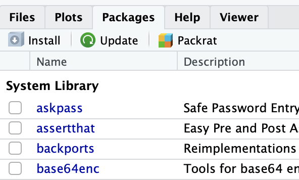
```

In the window that has just opened, enter the name of the packages separated by either a space or a comma.

```{r InstallWindow,echo=FALSE,message=FALSE,error=FALSE,out.width=cst,fig.align='center'}
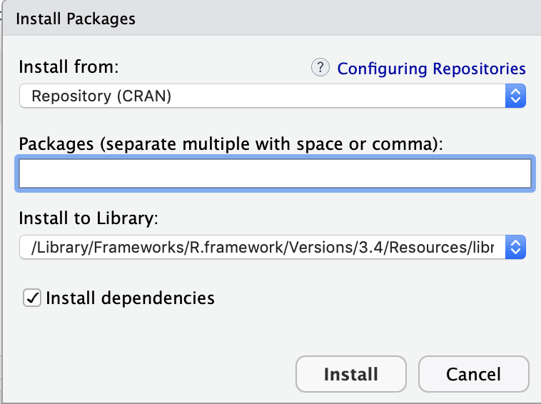
```

Done!

## Getting started

You're almost almost there.

### Forking STCI on GitHub

Forking does not sound super cool, but it's not as bad as it sounds.
It just means that you are going to create your own version of STCI on GitHub. 
It is not necessary (you could dowload STCI directly from my repository), but it makes interactions much smoother because we can use all the GitHub infrastructure to communicate and merge your changes to STCI, instead of resorting to lines of code, and everyone hates lines of code, right?
Convinced?

OK, so you just have to log in to GitHub and to go to the [original GitHub repository](https://github.com/chabefer/STCI). 
Now, just click on the *Fork* button that you can see on the top right corner.

```{r Fork,echo=FALSE,message=FALSE,error=FALSE,out.width=cst,fig.align='center'}
include_graphics("https://git-scm.com/book/en/v2/images/forkbutton.png")
```

After a few seconds, you should be directed to your own repo, with your own copy of STCI.

### Downloading STCI

In order to download STCI on your computer, follow the following steps in Rstudio:

1. Click on ``File``, ``New Project...``
2. In the dialog box, click on ``Version Control``

```{r RstudioGitOpen,echo=FALSE,message=FALSE,error=FALSE,out.width=cst,fig.align='center'}
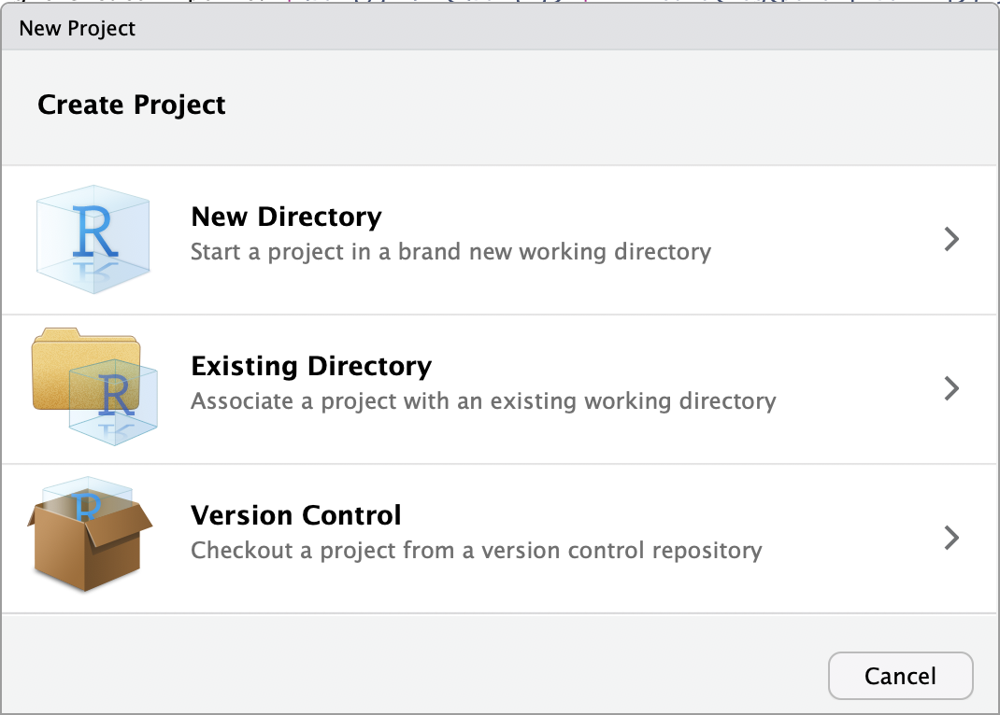
```

3. In the following dialog box, click on ``Git``

```{r VersionControl,echo=FALSE,message=FALSE,error=FALSE,out.width=cst,fig.align='center'}
include_graphics("./tutoSTCI_files/VersionControl.png")
```

4. In the following dialog box, enter ``https://github.com/YourGitHubUserName/STCI `` in the ``Repository URL`` field, where ``YourGitHubUserName`` is your GitHub username.

```{r CloneGit,echo=FALSE,message=FALSE,error=FALSE,out.width=cst,fig.align='center'}
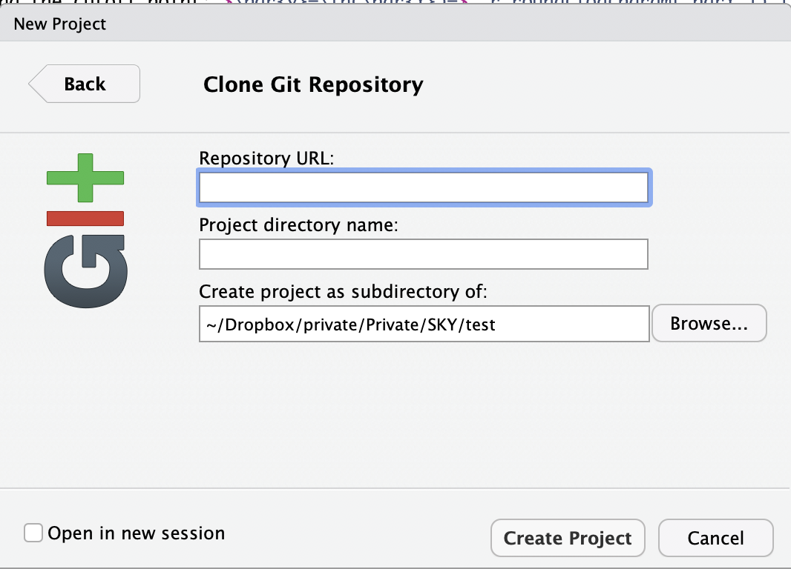
```

If you're not sure what your username is, just copy/paste the whole address of the repo from the address bar of your web browser.

5. Choose any name you want for the directory, although **STCI** seems appropriate.
6. Click on ``Browse`` to select where you want the project to be on your computer.
7. Don't check the ``Open in new session`` box unless you wish to keep the current session open while a new Rstudio session is created with STCI on it.
8. Click on ``Create Project``

Rstudio clones all the files from the STCI repository and opens a session with STCI as main project.
You're almost there.

### Build

OK, now it's time to hit the ``Build`` button and to get STCI to run on your computer. 
In order to do so, let's click on the ``Build`` panel that is normally on the top right corner of the Rstudio window.

```{r Build,echo=FALSE,message=FALSE,error=FALSE,out.width=cst,fig.align='center'}
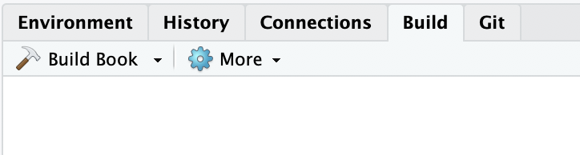
```

Go ahead, and hit the ``Build Book`` button, yes, the one with a nice hammer on it.

```{r BuildButton,echo=FALSE,message=FALSE,error=FALSE,out.width=cst,fig.align='center'}
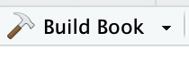
```

Shazam, you should have all the html files generated as well as a viewer opening with the STCI book in website format for your eyes to see.
If you click on the dowload icon:

```{r Download,echo=FALSE,message=FALSE,error=FALSE,out.width="5%",fig.align='center'}

```

you can retrieve the pdf version as well.
Another way is to open the ``/docs/`` folder.
That's where the pdf file is stored, along with the ``.html`` files.

## Making changes to STCI

Now you can make all the changes you want to the STCI book.
You can update the text. 
You can tinker with the code.
You can add a new webpage.
You can add new data.
Here is how you would do that.

### Updating the text

Updating the text is the easiest thing to do.
Here is how to do it:

1. Open the ``.Rmd`` file that you want to update.
Only ``.Rmd`` files should be updated, not ``.html`` files.
At some points, you might want to fine tune the ``.css`` and ``.yml`` files, but not for now, young padawan.
To do so, go to the ``Files`` panel in the bottom right corner of the Rstudio window and opend the RMarkdown files to find the one you want to alter.


```{r FilesPanel,echo=FALSE,message=FALSE,error=FALSE,out.width=cst,fig.align='center'}
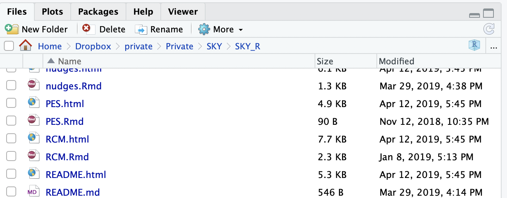
```

2. Make changes to the text in the Rmarkdown file.
In order to do make changes, you need to understand a little bit how the Markdown syntax works.
All you need to know to get started is [here](https://rmarkdown.rstudio.com/authoring_basics.html).

### Tinkering with the R code

What is awesome with an Rmarkdown document is that the code analyzing the data is seamlessly integrated in the same ``.Rmd`` file as the text commenting it, so that each time you build the website, or ``Knit`` the file, the R code is run and tables, figures, etc, are automatically generated.
That's what makes the constantly updated meta-analysis possible.
Each change to the code and data is seamlessly translated in the web page or the pdf document.
Also, you never lose track of how a results has been generated, so that it is costless to check a results by yourself.
And if you do not want the code to run each time, the amazing ``cache`` option enables you to store the results from the chunk and neveer compute them as long as the code chunk has not changed.
Pretty cool, huh?

R code chunks appear in grey in between ticks in the ``.Rmd`` files.
For example, the third code chunk in the ``01_FPI.Rmd`` file reads:

<pre><code>```{r param.init,eval=TRUE,echo=TRUE,results='markup'}
param <- c(8,.5,.28,1500)
names(param) <- c("barmu","sigma2mu","sigma2U","barY")
param
```
</code></pre>

```, three ticks, marks the beginning and end of a code chunk.
I'll come back to code chunks later.
But for now, you can locate each part of the R code and make changes to the statistical analysis.

### Adding a new file

The book is divided in several files.
Files correspond to chapters in the book.
The first file, where the title, authorship and introduction are located, is called ``index.Rmd``.
The following files are numeroted.
For the moment, only the first chapter is online, ``01_FPI.Rmd``.
Here is the planned roadmap for the book, along with the proposed file names:

* Part 1: The Two Fundamental Problems of Inference
    + Chapter 1: The Fundamental Problem of Causal Inference (``01_FPI.Rmd``)
    + Chapter 2: The Fundamental Problem of Statistical Inference (``02_FPSI.Rmd``)
* Part 2: Methods of Causal Inference
    + Chapter 3: Randomized Controlled Trials (``03_RCT.Rmd``)
    + Chapter 4: Natural Experiments (``04_NE.Rmd``)
    + Chapter 5: Observational Methods (``05_OM.Rmd``)
* Part 3: Additional Important Topics
    + Chapter 6: Power analysis (``06_Power.Rmd``)
    + Chapter 7: Placebo tests (``07_Placebo.Rmd``)
    + Chapter 8: Estimating precision when observations are not i.i.d. (``08_Cluster.Rmd``)
    + Chapter 9: Estimating the bias of observational methods (``09_LaLonde.Rmd``)
    + Chapter 10: Diffusion effects (``10_Diffusion.Rmd``)
    + Chapter 11: Distributional effects (``11_Distribution.Rmd``)
    + Chapter 12: Meta-analysis (``12_Meta.Rmd``)

Now, you want to create a new file, so it has to be that you want to insert a new chapter into the STCI book.
How would you do that?
Well, read on.

Click on the ``+`` button on the top left corner of the Rstudio window.

```{r NewRmdButton,echo=FALSE,message=FALSE,error=FALSE,out.width=cst,fig.align='center'}
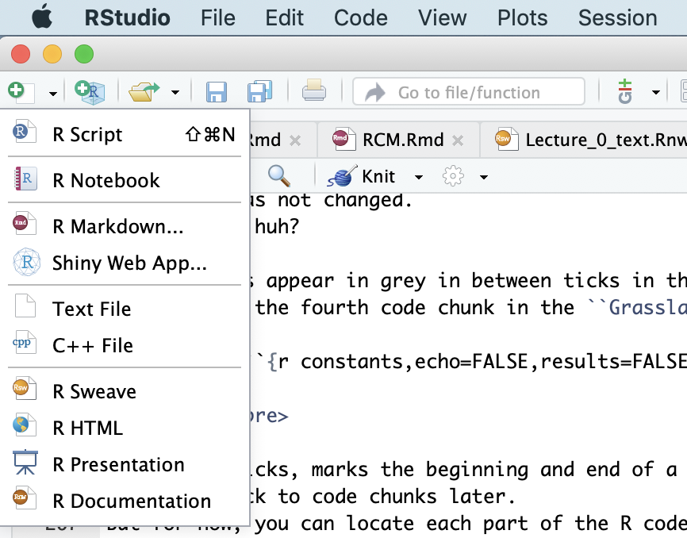
```

Click on ``R Markdown`` and follow the steps (nothing irreparable is done here, so you can just keep the defaults settings).
Save the new page under the name you want to give it.
The numbering of the files decides the order in which they are organized in the book.
So it is important to get the order right.
If you want to add a file in between two preexisting files that follow each other, use the trick ``01a_SomethingNew.Rmd`` instead of renaming everything (Git can ddeal wirth renaming, but it is a little tricky).

Now, you're done.
You can start playing around with the file, changing the title, writing text, adding code.

### Run STCI with your changes

In order to run the changes you have made to the STCI book to see if they work, I suggest a two-step approach, but feel free to skip step one.

1. Check that the page you have modified runs as a stand alone document.
In order to do so, click on the ``knit`` button in the top left corner of the Rstudio window.

```{r KnitButton,echo=FALSE,message=FALSE,error=FALSE,out.width=cst,fig.align='center'}
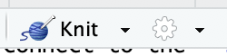
```

A new ``.html`` page should appear.
How nice, right?
If you click on the ``Down`` arrow close to the knit button, you can choose the format you want the output in, ``.html`` or ``.pdf``.

2. Run the whole STCI book.
For that, hit the ``Build Book`` button, yes, the one with a nice hammer on it.

```{r BuildButton.2,echo=FALSE,message=FALSE,error=FALSE,out.width=cst,fig.align='center'}

```

OK, does the nice STCI website appear?
If not, then you might have a bug.

### Debugging

Debugging in Rstudio is made super easy in this [tutorial](https://www.rstudio.com/products/rstudio/release-notes/debugging-with-rstudio/).
You have to run the R code alone in order to debug, which is made super easy by the ``Run`` button in Rstudio, on the top right corner of the main window, the one with a green arrow on it.

```{r RunButton,echo=FALSE,message=FALSE,error=FALSE,out.width=cst,fig.align='center'}
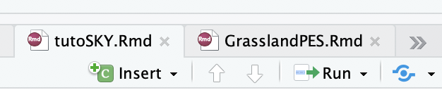
```

Bug messages from RMarkdown are in general pretty useful, so you should be able to decide where the problem comes from (R or Markdown) and from which chunk or part of the text.

## Uploading your changes to the web

Ok, so now you've worked on the STCI book for some time, you have made adjustments, corrected typos, tinkered with the code, maybe even added a page or some data.
How do you move all of this to the web, so that SKY users can see it?
This is where Git and GitHub come in handy
Let's read on ;)

### Commiting your changes to Git

The first thing to do is to tell your local Git repository that you have made all these changes.
In order to do so, click on the ``Git`` thumbnail on the top right corner of the Rstudio window.

```{r GitPanel,echo=FALSE,message=FALSE,error=FALSE,out.width=cst,fig.align='center'}
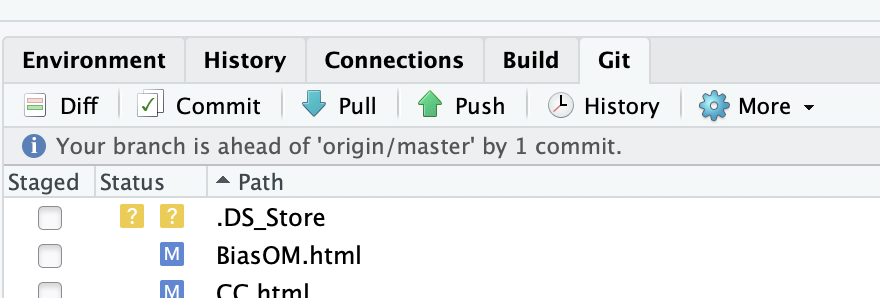
```

All the files that you have either created or modified should appear there.
The files that you have modified should have a blue ``M`` in front of them.
The files that you have created should have a yellow ``?`` in front of them.

Click on the ``Staged`` button in front of each of the modified or newly created file.
This stages your files for Git.
For a modified file, it tells Git that it should commit their changes if you ask him to.
The blue ``M`` moves to the left, indicating that the modifications are now ready to be committed.
For a created file, staging says to Git to add them to the list of files that it follows.
A green ``A`` appears in front of the file, it has been ``Added`` to the Git repo.

Click on the ``Commit`` button at the top of the Git window.
A new window, the committing window, appears.

```{r CommitWindow,echo=FALSE,message=FALSE,error=FALSE,out.width=cst,fig.align='center'}
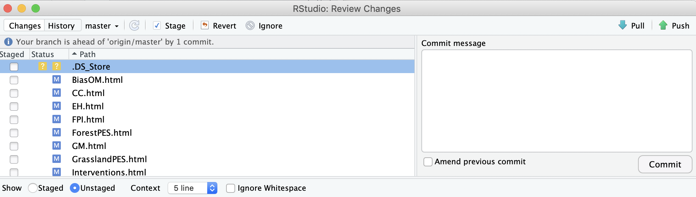
```

Type a clear commit message explaining what you did in the ``Commit message`` box.
Click on the ``Commit`` button just below the ``Commit message`` box.
A new box opens.
Close it when the Git code has finished running.
Close the commit window.
Done! 

### Sending your changes to your GitHub repository

You will not believe this, but sending your changes to GitHub repository only requires to click on one button.
Yes, only one.
It is the ``Push`` button marked with a green arrow pointing upwards in the Git panel.

```{r PushButton,echo=FALSE,message=FALSE,error=FALSE,out.width=cst,fig.align='center'}
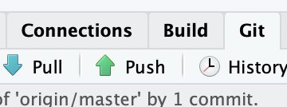
```

Go ahead and click ;)
A box should open, and then a window asking you your id and password for accessing your GitHub account.
Fill in the info.
Click on ``Submit``.
Done!
You have almost made your first contribution to open science.

### Sending a merge request

When you are happy with what you have done and do not see how to improve it any further, you can notify **SKY** of your changes and ask for them to be included into the actual website.
In order to do so, you have to log in to your GitHub account and go to the **STCI** page on YOUR account ``https://github.com/YourGitHubUserName/STCI ``.
Click on the ``New Pull Request`` button and follow the instructions that you are given.

```{r NewPullButton,echo=FALSE,message=FALSE,error=FALSE,out.width=cst,fig.align='center'}
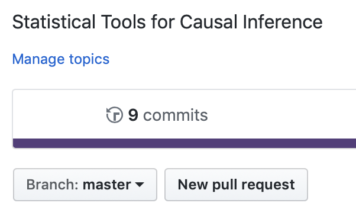
```

If you are uncertain of what to do, look [here](https://git-scm.com/book/en/v2/GitHub-Contributing-to-a-Project).
Once you have submitted your pull request, I will examine it, we might have some back and forth discussion and then, when everything is OK, I'll accept the pull request.
Your work will be merged into the original STCI project and will appear online.
You will have made your first contribution to open science!
Congrats :)


